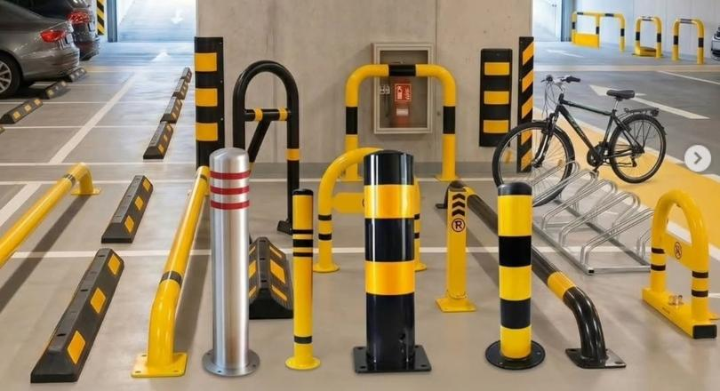

# Otopark Ekipmanları

**Product-catalogue website for a parking-equipment supplier in Ostim, Ankara — wheel stops, parking barriers, column corner guards and bike racks.**


> Client project — designed and developed by [Berke Coşkuner](https://github.com/CoskunerBerke) for **Otopark Ekipmanları** (a TRİ Metal Yapı company).

**Live:** [otoparkekipmani.com](https://otoparkekipmani.com)



---

## Overview

Otopark Ekipmanları sells steel parking and safety equipment from Prestij Business Center in Ostim (Yenimahalle, Ankara) and operates as part of **TRİ Metal Yapı**. This Turkish-language website is the company's online catalogue: it introduces the five main product categories, explains the company's relationship with TRİ Metal, and makes it easy for businesses to call, email or find the office to request a quote.

All company details (name, phone numbers, e-mail, address, opening hours, Google Maps links, parent company) live in a single config file, so the content can be updated without touching the page components.

## Features

- **Home** (`/`) — hero with call-to-action buttons, product category cards, "why us" highlights, TRİ Metal introduction and a quote call-to-action.
- **Products** (`/urunler`) — detailed catalogue of five categories, each with a description, image and feature list:
  - steel wheel stops (araç stoperi)
  - steel parking barriers (otopark bariyerleri)
  - portable interlocking barriers (bariyer ürünleri)
  - column and corner guards (kolon köşe koruyucular)
  - galvanised bike racks (bisiklet park demirleri)
- **About** (`/hakkimizda`) — company profile and the link to TRİ Metal Yapı.
- **Contact** (`/iletisim`) — address, phone, e-mail, opening hours, "view on map" link and an embedded Google Map.
- **Central business config** — `src/config/business.ts` feeds the header, footer and all pages.
- **SEO** — per-page titles and descriptions via the Next.js Metadata API (title template, Turkish keywords, Open Graph).
- Responsive header with a mobile menu and click-to-call links.
- **Static export** — the whole site builds to plain HTML/CSS/JS.

## Tech stack

| Layer | Technology |
| --- | --- |
| Framework | Next.js 16 (App Router, `output: "export"`) |
| UI | React 19, TypeScript |
| Styling | Global CSS with custom properties (yellow/black theme) + inline styles |
| Icons | lucide-react |
| Fonts | Inter and Outfit (Google Fonts) |
| Linting | ESLint 9 + `eslint-config-next` |

## Project structure

```text
otopark/
├── public/images/           # product photos, hero image, logo
├── next.config.ts           # static export, trailing slashes, unoptimized images
└── src/
    ├── app/
    │   ├── layout.tsx       # metadata + Header/Footer
    │   ├── page.tsx         # home
    │   ├── urunler/         # product catalogue
    │   ├── hakkimizda/      # about
    │   ├── iletisim/        # contact + map
    │   └── globals.css      # design tokens and shared styles
    ├── components/layout/
    │   ├── Header.tsx       # navigation + mobile menu
    │   └── Footer.tsx
    └── config/
        └── business.ts      # company name, contact info, maps, parent company
```

## Getting started

Requirements: Node.js (a version supported by Next.js 16) and npm.

```bash
git clone https://github.com/CoskunerBerke/otopark.git
cd otopark
npm install
npm run dev        # http://localhost:3000
```

| Script | What it does |
| --- | --- |
| `npm run dev` | Start the dev server (`next dev --webpack`) |
| `npm run build` | Build the static site (`next build --webpack`) |
| `npm run lint` | Run ESLint |

No environment variables are required. To change contact details, edit `src/config/business.ts`.

## Deployment

`next.config.ts` sets `output: "export"`, `trailingSlash: true` and `images.unoptimized: true`, so `npm run build` writes a fully static site to `out/`. Upload that folder to any static host (shared hosting, Netlify, Vercel, GitHub Pages, etc.).

---

## Türkçe

**Ankara Ostim'deki otopark ekipmanı tedarikçisi için ürün kataloğu sitesi — araç stoperleri, otopark bariyerleri, kolon köşe koruyucular ve bisiklet park demirleri.**

> Müşteri projesi — **Otopark Ekipmanları** (bir TRİ Metal Yapı kuruluşu) için [Berke Coşkuner](https://github.com/CoskunerBerke) tarafından tasarlanıp geliştirildi.

**Canlı site:** [otoparkekipmani.com](https://otoparkekipmani.com)

### Genel bakış

Otopark Ekipmanları, Ostim Prestij Business Center'dan (Yenimahalle, Ankara) demir otopark ve güvenlik ürünleri satan, **TRİ Metal Yapı** bünyesindeki bir firmadır. Bu Türkçe site firmanın çevrim içi kataloğudur: beş ana ürün grubunu tanıtır, TRİ Metal ile ilişkisini anlatır ve işletmelerin teklif için kolayca aramasını, e-posta göndermesini ya da ofisi haritada bulmasını sağlar.

Firma bilgilerinin tamamı (isim, telefonlar, e-posta, adres, çalışma saatleri, Google Haritalar bağlantıları, ana şirket) tek bir yapılandırma dosyasında tutulur; içerik, sayfa bileşenlerine dokunmadan güncellenebilir.

### Özellikler

- **Ana sayfa** (`/`) — aksiyon butonlu hero, ürün kategorisi kartları, "neden biz" bölümü, TRİ Metal tanıtımı ve teklif çağrısı.
- **Ürünler** (`/urunler`) — açıklama, görsel ve özellik listesiyle beş kategori: demir araç stoperi, demir otopark bariyerleri, taşınabilir/kilitlenebilir bariyer ürünleri, kolon köşe koruyucular, galvanizli bisiklet park demirleri.
- **Hakkımızda** (`/hakkimizda`) — firma profili ve TRİ Metal Yapı bağlantısı.
- **İletişim** (`/iletisim`) — adres, telefon, e-posta, çalışma saatleri, "haritada gör" bağlantısı ve gömülü Google Haritası.
- **Merkezi firma ayarları** — `src/config/business.ts` header, footer ve tüm sayfaları besler.
- **SEO** — Next.js Metadata API ile sayfa bazlı başlık ve açıklamalar (başlık şablonu, Türkçe anahtar kelimeler, Open Graph).
- Mobil menülü duyarlı header ve tıkla-ara bağlantıları.
- **Statik çıktı** — site tamamen düz HTML/CSS/JS olarak derlenir.

### Teknolojiler

Next.js 16 (App Router, statik export), React 19, TypeScript, global CSS + CSS değişkenleri, lucide-react, Inter / Outfit yazı tipleri, ESLint 9.

### Kurulum

```bash
git clone https://github.com/CoskunerBerke/otopark.git
cd otopark
npm install
npm run dev        # http://localhost:3000
```

Ortam değişkeni gerekmez. İletişim bilgilerini değiştirmek için `src/config/business.ts` dosyasını düzenleyin.

### Yayına alma

`next.config.ts` içinde `output: "export"` tanımlı olduğundan `npm run build` komutu statik siteyi `out/` klasörüne üretir. Bu klasör herhangi bir statik barındırma hizmetine yüklenebilir.

---

Built by [Berke Coşkuner](https://github.com/CoskunerBerke)
